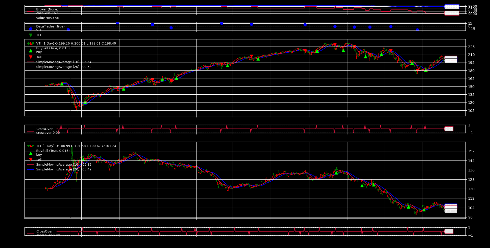
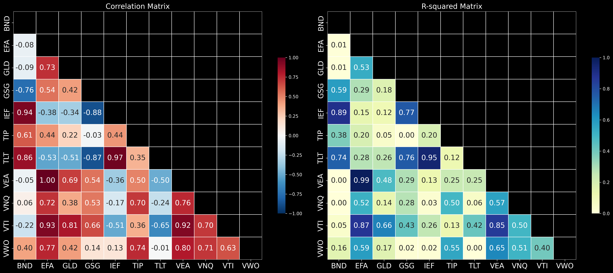

# Backtrader Multi-Asset Strategy on Amazon Q Developer

A Backtrader implementation that uses a Simple Moving Average (SMA) strategy for buy/sell signals on multi-asset data.

## Project Structure

- `download_historical_data.py`: Script to download historical stock data from Yahoo Finance
- `app.py`: Main application file with Backtrader implementation
- `r2_correlation_matrix.py`: Script to analyze ETF correlations and create visualizations
- `data/`: Directory containing the downloaded stock data

## Strategy

The strategy implemented in this project is a Simple Moving Average (SMA) crossover strategy:

- Buy signal: When the fast SMA (10-period) crosses above the slow SMA (30-period)
- Sell signal: When the fast SMA (10-period) crosses below the slow SMA (30-period)

## Requirements

- Python 3.6+
- backtrader
- yfinance
- matplotlib
- pandas
- seaborn

## Installation

```bash
pip install -r requirements.txt
```

## Usage

1. First, download the historical data:

```bash
python download_historical_data.py
```

2. Then, run the Backtrader strategy:

```bash
python app.py
```

3. To analyze ETF correlations and create visualizations:

```bash
python r2_correlation_matrix.py
```

## Results

### Backtrader Strategy
The application will display:
- Starting and final portfolio values
- Trade execution details
- Performance metrics (Sharpe Ratio, Drawdown, Returns)
- A chart showing the price action, SMA indicators, and buy/sell points



### Correlation Analysis
The r2_correlation_matrix.py script generates:
- Correlation matrix and R-squared matrix heatmaps
- Bar charts showing average correlation and R-squared values for each ETF
- CSV files with detailed correlation data for further analysis




